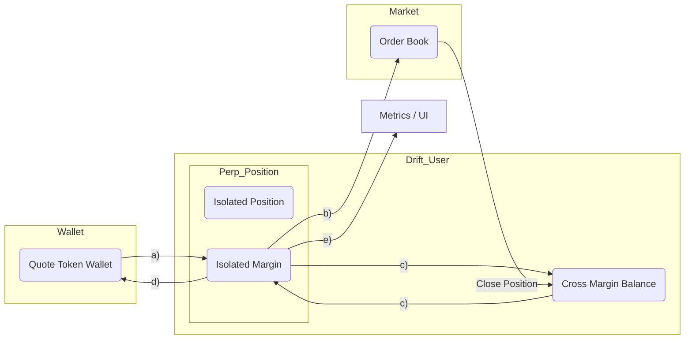

# solana-drift-isolated-trade-poc

Proof‑of‑concept stack that lets a Next.js frontend drive Drift isolated perp trades through a Rust order‑execution API (with a TypeScript SDK worker) and a dedicated indexing service. The legacy `backend/` directory is deprecated; all runtime logic now lives under `order-execution-service/` and `order-indexing-service/`.

---

## High-level Architecture

```
┌─────────────┐        HTTP/JSON         ┌─────────────────────────┐
│  Frontend   │ ───────────────────────► │ Order Execution Service │
│ (Next.js)   │                          │  Axum API + Tx executor │
└────┬────────┘                          └──────────┬──────────────┘
     │  polling / SSE for health & data            │
     │                                             │ JSON/IPC over stdio
     │                                             ▼
     │                                   ┌─────────────────────────┐
     │                                   │ TypeScript Worker       │
     │                                   │ (@drift-labs/sdk)       │
     │                                   └──────────┬──────────────┘
     │                                             │ unsigned tx build / queries
     │                                             ▼
     │                                   ┌─────────────────────────┐
     │                                   │ Solana Devnet RPC + WS  │◄─────┐
     │                                   │ (Helius / api.devnet)   │      │
     │                                   └──────────┬──────────────┘      │
     │  REST / polling                               ▲                     │
     ▼                                               │                     │
┌────────────────┐       HTTP/JSON                   │   log stream / RPC  │
│ Indexing Svc   │◄──────────────────────────────────┘                     │
│ (streamer +    │                                                         │
│ history API)   │◄───────────────────────────────┐                         │
└────────────────┘        DB reads                │ supabase/postgres      │
                                                     trade_history table
```

- **Frontend** calls both backends directly. It renders health indicators, shows live position stats, and submits orders/margin actions on behalf of the admin wallet.
- **Order Execution Service** exposes the Drift control plane. It multiplexes requests to the TypeScript worker over JSON‑IPC, optionally signs/executes transactions in Rust, and talks to Solana RPC/WS for transaction submission + program logs.
- **Indexing Service** streams Drift logs (via the same RPC provider or a Geyser endpoint), persists normalized trades into `trade_history`, and serves `/history` so the UI can display the audit trail.
- **Solana Devnet** is the single chain target. Both the TS worker and the Rust executor share the same `RPC_URL`/`RPC_WS_URL` so signatures, balance reads, and tx simulations stay consistent.

---

## User Flow

```
┌────────────┐      1. load UI / fetch health      ┌──────────────────────────┐
│   Admin    │ ──────────────────────────────────► │ Frontend (Next.js)       │
└────┬───────┘                                      │ - shows health badges    │
     │ 2. fills order/deposit forms                 │ - renders positions      │
     ▼                                              └───────┬──────────────────┘
┌────────────┐                                          3a  │ build-only call
│  Actions   │─────────────────────────────────────────────►│POST /orders/...   │
│ (open/close│                                              │GET /balances/...  │
│ deposit...)│◄─────────────────────────────────────────────┤3b  execute call   │
└────────────┘        4. responses / tx base64/signature    └───────┬───────────┘
                                                                    │
                                                                    ▼
                                               ┌────────────────────────────┐
                                               │ Order Execution Service    │
                                               │ - validates payloads       │
                                               │ - forwards to TS worker    │
                                               │ - signs/submits on /execute│
                                               └──────────┬─────────────────┘
                                                          │ 5. JSON IPC
                                                          ▼
                                               ┌────────────────────────────┐
                                               │ TypeScript Drift Worker    │
                                               │ - queries Drift markets    │
                                               │ - builds unsigned txs      │
                                               │ - returns metadata         │
                                               └──────────┬─────────────────┘
                                                          │ 6. RPC read/write
                                                          ▼
                                               ┌────────────────────────────┐
                                               │ Solana Devnet RPC / WS     │
                                               │ - account reads            │
                                               │ - tx simulation + submit   │
                                               └──────────┬─────────────────┘
                                                          │ 7. program logs
                                                          ▼
                                               ┌────────────────────────────┐
                                               │ Indexing Service           │
                                               │ - streams Drift logs       │
                                               │ - backfills history        │
                                               │ - serves GET /history      │
                                               └──────────┬─────────────────┘
                                                          │ 8. /history fetch
                                                          ▼
┌────────────────────────────────────────────────────────────────────────────┐
│ Frontend refreshes live table & mocked trade history until indexer ready   │
└────────────────────────────────────────────────────────────────────────────┘
```

- Steps 1‑4: the admin interacts with forms, the frontend calls the Axum API, and receives either unsigned transactions (to hand over to a wallet) or immediate signatures when using `/execute`.
- Steps 5‑7: the API proxies to the TS worker; both the worker and executor communicate with Solana RPC/WS. The streaming/indexing path captures the same signatures and persists them to Supabase/Postgres.
- Step 8: the frontend queries `/history` to populate the trade table whenever the indexing service is online (falls back to `/trade-history` otherwise).

---

## Components & responsibilities

| Component | Responsibilities | Key Env |
| --- | --- | --- |
| `frontend/` | Next.js UI for admin-driven isolated perps. Calls `/orders/*`, `/balances`, `/positions`, `/history`, etc. Displays live monitoring + mocked trade history until the indexer is available. | `.env.local` (`NEXT_PUBLIC_ORDER_EXECUTION_URL`, `NEXT_PUBLIC_DRIFT_INDEXER_URL`, `DB_HOST`) |
| `order-execution-service/ipc-poc/ts-worker` | TypeScript worker that wraps `@drift-labs/sdk@2.146.0-alpha.13`. Builds unsigned transactions, provides read endpoints (markets, positions, trades, isolated balance). Communicates with Rust via JSON lines on stdio. | `.env` (`RPC_URL`, optional `SERVER_PRIVATE_KEY`, `SERVER_KEYPAIR_PATH`) |
| `order-execution-service/ipc-poc/rust-api` | Axum API. Manages the Node worker lifecycle, multiplexes IPC calls, validates inputs, and (when hitting `/execute` routes) signs + submits via the built-in executor. Logs every incoming request with payload + URI. | `.env` (same RPC vars, `TS_WORKER_PATH`, `TS_NODE_PATH`, `SERVER_PRIVATE_KEY`, `RPC_URL`, etc.) |
| `order-indexing-service/` | Rust workspace with three binaries: realtime streamer (`indexer-bin`), historical backfill (`backfill-bin`), and the HTTP history API (`history-bin`). They share `indexer-common` for Drift log parsing + DB helpers. | `.env` (`RPC_URL`, `RPC_WS_URL`, `ADMIN_WALLET`, `DRIFT_PROGRAM_ID`, `DRIFT_ACCOUNT_ID`, `DATABASE_URL`, `INDEXER_HTTP_PORT`, `HISTORY_PORT`, `BACKFILL_LIMIT`) |
| `Supabase/Postgres` | Stores the normalized trade timeline (`trade_history`). Both the history API and the frontend read from it. |

---

## API surface

### Order Execution Service (Axum, port 8080 by default)

| Method & Path | Description |
| --- | --- |
| `GET /server/public-key` | Returns the server wallet pubkey (derived from `.env` signing key). |
| `GET /positions?wallet=<pubkey>` | Snapshot of isolated perp positions for the wallet. |
| `GET /positions/details?wallet=<pubkey>` | Rich position stats (PnL, entry, liq, leverage, size, current price). |
| `GET /positions/isolated-balance?wallet=<pubkey>&market=<symbol>` | Calls `getIsolatedPerpPositionTokenAmount` to expose isolated balances. |
| `GET /balances?wallet=<pubkey>` | Wallet + Drift account balances (SOL + SPL). |
| `GET /trade-history?wallet=<pubkey>` | Worker-provided trade summary (used until the indexer API fully replaces it). |
| `GET /markets/:symbol` | Drift market oracle + funding data for the symbol. |
| `POST /orders/open-isolated` | Returns unsigned tx + metadata for `depositIntoIsolatedPerpPosition` + open order. |
| `POST /orders/open-isolated/execute` | Same as above, but the Rust executor signs/submits and returns `txSignature`. |
| `POST /orders/close` | Build unsigned close-position tx (optionally with partial `size`). |
| `POST /orders/close/execute` | Build and immediately execute a close transaction. |
| `POST /margin/transfer` | Build unsigned `transferIsolatedPerpPositionDeposit` tx (move margin between isolated/cross). |
| `POST /margin/transfer/execute` | Executes that transfer on-chain via the server key. |
| `POST /margin/deposit-native` | Build unsigned deposit of native SOL into Drift account. |
| `POST /margin/deposit-native/execute` | Execute native SOL deposit server-side. |
| `POST /margin/deposit-token` | Build unsigned SPL token deposit (e.g., USDC/WSOL) into Drift. |
| `POST /margin/deposit-token/execute` | Execute the SPL deposit (creates ATA if missing). |

Every request is logged (`url`, label, JSON payload). IPC calls have a default timeout of 10s with auto worker restart on crash. `/execute` routes require `SERVER_PRIVATE_KEY` to be configured; otherwise they return a signing error.

### Indexing Service

| Binary | Method & Path | Description |
| --- | --- | --- |
| `indexer-bin` | `GET /health` | Returns `{ status, last_slot, last_signature }`. The process also streams Drift logs over WebSocket (`RPC_WS_URL`), re-fetches each tx via HTTP RPC, and inserts rows into `trade_history`. |
| `history-bin` | `GET /history?wallet=<pubkey>&limit=50&offset=0` | Reads from Postgres and returns canonical trade entries (signature, action, amount, asset symbol/mint, slot, block time). Defaults to the admin wallet when `wallet` is omitted. |
| `backfill-bin` | _CLI only_ | `cargo run -p backfill-bin` reads signatures for the admin wallet + Drift account (up to `BACKFILL_LIMIT` each), fetches the transactions, and inserts missing trades. Idempotent via `ON CONFLICT (signature) DO NOTHING`. |

The frontend should prefer `/history` for the trade table once the indexing service is running; until then, `/trade-history` from the order-execution worker can act as a fallback.

---

## Frontend Environment

Create `frontend/.env.local` with:

```
NEXT_PUBLIC_ORDER_EXECUTION_URL=http://localhost:8080
NEXT_PUBLIC_DRIFT_INDEXER_URL=http://localhost:4000
DB_HOST=localhost
```

Start the UI:

```bash
cd frontend
yarn install
yarn dev
```

The frontend pings `/health` on both services to show availability badges and calls the order routes (open/close, deposit/withdraw) using the admin wallet settings.

---

## Running the backends locally

### Order execution service

```bash
cd order-execution-service/ipc-poc/ts-worker
yarn install
yarn build             # or yarn dev during active work

cd ../rust-api
cargo run              # spawns the worker automatically
```

Populate `order-execution-service/.env` (copy from `.env.template`) with:

```
RPC_URL=https://devnet.helius-rpc.com/?api-key=...
SERVER_PRIVATE_KEY=<base58>
TS_WORKER_PATH=ipc-poc/ts-worker/dist/index.js
```

The Rust API rebuilds the worker `dist/` when running inside Docker (`docker compose up --build`). Outside Docker, rebuild manually after TypeScript edits.

### Indexing service

```bash
cd order-indexing-service
cp .env.example .env  # fill RPC + Supabase creds

cargo run -p backfill-bin   # optional one-off historical import
cargo run -p indexer-bin    # realtime log streamer + /health
cargo run -p history-bin    # serve GET /history on HISTORY_PORT
```

Before running, create the table once (see `order-indexing-service/README.md` for the SQL schema). Supabase credentials go into `DATABASE_URL`.

---

## Docker (optional)

You can still spin up the main frontend + order execution pair with:

```bash
docker compose up --build
```

This rebuilds the TS worker `dist/` every time and launches:

- `order-execution-service` on `http://localhost:8080`
- `frontend` on `http://localhost:3000`

Environment overrides can be supplied through `.env` or `docker compose` CLI flags. Stop with `docker compose down`.

---

## How the frontend interacts with the backends

1. **Health + readiness**
   - On load, the UI pings `GET /health` on the order execution API (internal route) and on the indexing service (`http://localhost:4000/health`) to render status indicators.
2. **Position lifecycle**
   - To open a position, the UI calls `POST /orders/open-isolated` (unsigned) or `/execute` when using the admin signer. The API forwards the request to the TS worker (`fn=openIsolated`), receives the unsigned transaction + metadata, and either returns it or signs/submits via the Rust executor. The worker contacts Solana RPC to fetch market data + build instructions but never broadcasts.
   - Closing positions, transferring margin, or depositing native/SPL assets follow the same pattern with their respective endpoints. `/execute` routes submit through the Rust executor, which logs program/RPC errors and surfaces them to the UI.
3. **Balance + market data**
   - `GET /positions`, `/balances`, `/markets/:symbol`, `/positions/isolated-balance`, etc., all proxy through the TS worker, which queries Drift over RPC and returns JSON to the frontend.
4. **Trade history**
   - The UI calls `GET /history` on the indexing service for authoritative trade data. The streamer ingests Drift program logs via WebSocket (`RPC_WS_URL`), replays the full transaction via HTTP RPC, extracts account/token deltas, and stores them in Postgres. When the streamer is down or backfill hasn’t run, the UI can fall back to `GET /trade-history` on the order execution API.

### Isolated Perp Money Flow

```
Legend:
a) depositIntoIsolatedPerpPosition
b) placePerpOrder (optional isolatedPositionDepositAmount)
c) transferIsolatedPerpPositionDeposit
d) withdrawFromIsolatedPerpPosition
e) getIsolatedPerpPositionTokenAmount
```



By separating execution from indexing we keep signing/tx submission isolated inside the order-execution service while the indexer focuses on analytics and can be scaled independently.
